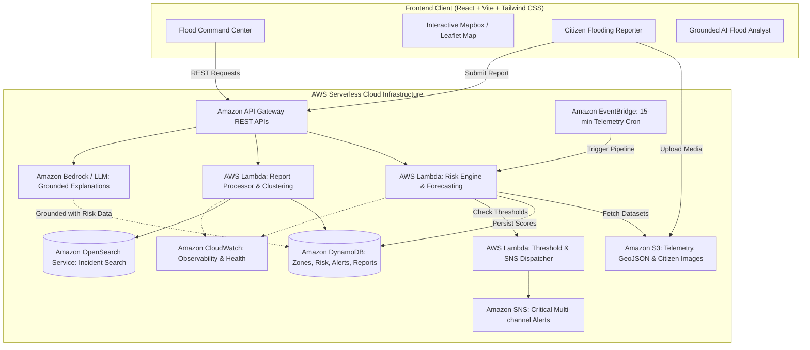

# 🌊 FloodSense
### *AI-Powered Hyperlocal Flood Intelligence & Response Platform*

[](https://www.wemakedevs.org/aws/env)
[](#aws-architecture)
[](LICENSE)

> **Predict. Verify. Respond.**  
> Moving from reactive flood observation to actionable, hyperlocal flood intelligence.

---

## 📌 Executive Summary

Current flood-monitoring systems routinely state: *"It is raining heavily."*  
For citizens and disaster response teams, that provides zero actionable insight. The real questions are:
- **Which specific neighborhoods and roads will submerge?**
- **At what hour will water levels cross critical thresholds?**
- **Why is a specific area vulnerable (elevation, drainage failure, accumulated rainfall)?**
- **What should citizens and municipal responders do right now?**

**FloodSense** is an end-to-end hyperlocal flood intelligence and emergency response platform built on **AWS Serverless infrastructure**. It combines real-time weather telemetry, topography, historical flood incident memory, and live citizen ground-truth reports to produce explainable risk indices, automated early-warning alerts, verified incident clustering, and grounded AI incident response recommendations.

---

## 🎯 Hackathon Metadata

| Field | Detail |
| :--- | :--- |
| **Event** | AWS Environmental Hacks (WeMakeDevs) |
| **Track** | **Heat & Water** (Floods & Monsoon Waterlogging) |
| **Hackathon Dates** | October 8 – October 11, 2026 |
| **Build Category** | Web Application + AWS Serverless Cloud Backend |
| **Primary Audience** | Citizens, Municipal Authorities, Emergency Responders |
| **Core Differentiator** | **Predict + Verify + Respond** (Explainable numerical risk engine + crowd-sourced incident ground truth + grounded AI analyst) |

---

## 🏛️ System Architecture



---

## 🚀 Key Features

1. **Hyperlocal Flood Risk Map (0–100 Risk Index):** Color-coded zone polygons (🟢 Low, 🟡 Moderate, 🟠 High, 🔴 Critical) calibrated to local elevation, drainage capacity, and rainfall accumulation.
2. **Transparent, Explainable Risk Engine:** Clear breakdown of exactly why a zone is flagged (e.g., *Rainfall 31.5 pts + Accumulation 21.25 pts + Low Elevation 11.25 pts*). No black-box guesses.
3. **Hyperlocal Forecast Horizon:** Predictive 3-hour window graph projecting future water accumulation and flood risk trends before critical points are reached.
4. **Actionable Smart Alerts:** Severity-tiered emergency notifications containing specific localized risk drivers, affected transit corridors, and preventative actions.
5. **Citizen Ground-Truth Reports:** Lightweight mobile-first reporting interface enabling citizens to submit real-time water levels (Road Wet, Ankle, Knee, Waist, Severe), descriptions, and geo-tagged images.
6. **Prediction vs. Reality Incident Verification:** Real-time feedback loop comparing mathematical model predictions against submitted citizen reports, confirming incidents and updating model confidence.
7. **Municipal Emergency Response Command Center:** Triage dashboard displaying active incidents, affected corridors, response priority rankings, and deployment checklists.
8. **Grounded AI Flood Analyst:** Natural-language intelligence assistant that generates plain-English briefings and tactical responder action steps strictly based on verified system telemetry.

---

## 📂 Documentation Directory

| Document | Description |
| :--- | :--- |
| [**Architecture & AWS Services**](file:///docs/architecture.md) | Full architectural breakdown, AWS services usage, data flow diagrams, and serverless patterns. |
| [**AWS Backend Deep-Dive**](file:///docs/aws_backend_architecture.md) | AWS serverless execution layer, Lambda microservices, DynamoDB, S3, and EventBridge deep-dive. |
| [**Frontend + AWS Integration**](file:///docs/frontend_integration_report.md) | How the cloned Next.js repo (`Flood_Monitoring_V1`) was enhanced with S3 photo uploads, Bedrock, and DynamoDB. |
| [**AWS Quick Deployment Guide**](file:///docs/aws_deployment_guide.md) | 5-minute deployment guide using AWS SAM / CloudFormation, seeding scripts, and smoke test commands. |
| [**V1 Evolution & Strategy**](file:///docs/v1_evolution_and_hackathon_strategy.md) | Comparative analysis of existing `flood-monitoring-v1`, feature gap analysis, and compliant transition strategy. |
| [**Risk Engine Methodology**](file:///docs/risk_engine_methodology.md) | Detailed mathematical formula, weighting criteria, normalization algorithms, and ML augmentation path. |
| [**API Specification**](file:///docs/api_specification.md) | Complete OpenAPI/REST endpoint specifications, schemas, payloads, and mock responses. |
| [**Database Schemas**](file:///docs/database_schemas.md) | DynamoDB single-table/multi-table designs, Partition Keys, Sort Keys, S3 bucket layout, and OpenSearch mappings. |
| [**AI Flood Analyst Specification**](file:///docs/ai_flood_analyst.md) | AI agent grounding guidelines, anti-hallucination guardrails, system prompts, and structured output schemas. |
| [**Citizen Verification Pipeline**](file:///docs/citizen_verification_pipeline.md) | Geospatial clustering, incident verification loop, report deduplication, and photo processing flow. |
| [**4-Day Hackathon Roadmap**](file:///docs/four_day_execution_plan.md) | Tactical step-by-step development schedule for Oct 8–11, milestone gates, and risk contingencies. |
| [**UI/UX Command Center Spec**](file:///docs/ui_ux_command_center_spec.md) | Dark-mode design system, color tokens, layout hierarchy, and micro-interaction specifications. |
| [**3-Minute Demo Video Script & Storyboard**](file:///docs/demo_video_master_plan.md) | Word-for-word voiceover script, second-by-second storyboard, tab-switching cues, and AWS Console walkthrough checklist. |
| [**Official Submission Writeup**](file:///docs/submission_writeup.md) | Formatted submission text for WeMakeDevs Devpost portal adhering to all competition judging criteria. |

---

## 🛠️ Tech Stack

- **Frontend:** React 19, Vite, Tailwind CSS, Lucide Icons, Recharts, Mapbox GL / Leaflet
- **Cloud Backend:** AWS Lambda (Python 3.12 / FastAPI runtime), Amazon API Gateway
- **Persistence & Search:** Amazon DynamoDB, Amazon S3, Amazon OpenSearch Service
- **Orchestration & Messaging:** Amazon EventBridge (Scheduler), Amazon SNS
- **AI / LLM Layer:** Amazon Bedrock (Anthropic Claude 3.5 Sonnet / Haiku) or Strands Agent framework
- **Telemetry & Monitoring:** Amazon CloudWatch Metrics & Logs

---

## 🧭 Repository Structure

```
floodsense/
├── frontend/                  # React + Vite web application
│   ├── src/
│   │   ├── components/        # Cards, navigation, alert banners, metric graphs
│   │   ├── pages/             # Command Center, Map, Alerts, Incidents, Reports, AI
│   │   ├── hooks/             # Custom React state & telemetry query hooks
│   │   ├── services/          # API Gateway client integration
│   │   └── utils/             # Color tokens, formatters, geospatial helpers
│   └── package.json
├── backend/                   # Python microservices / Lambda handlers
│   ├── api/                   # FastAPI route definitions & schemas
│   ├── risk_engine/           # Deterministic risk engine algorithms
│   ├── services/              # DynamoDB, S3, OpenSearch, SNS connectors
│   ├── ai/                    # Bedrock grounding client & structured prompt runners
│   └── requirements.txt
├── infrastructure/            # Infrastructure as Code (AWS SAM / CDK / Terraform)
│   ├── dynamodb/              # Table definitions & secondary indexes
│   ├── lambda/                # Function packaging & IAM role policies
│   ├── apigateway/            # OpenAPI route specifications
│   └── eventbridge/           # Cron trigger schedules
├── data/                      # Synthetic baseline datasets & geo schemas
│   ├── sample_zones.geojson   # Pilot geographic ward polygons
│   └── historical_floods.json # Baseline incident logs
├── docs/                      # Comprehensive technical & submission specs
│   ├── architecture.md
│   ├── risk_engine_methodology.md
│   ├── api_specification.md
│   ├── database_schemas.md
│   ├── ai_flood_analyst.md
│   ├── citizen_verification_pipeline.md
│   ├── four_day_execution_plan.md
│   ├── demo_video_script.md
│   └── submission_writeup.md
├── README.md
└── LICENSE
```

---

## ⚖️ Hackathon Compliance Notice

*This repository represents genuine, clean-slate work created specifically for the October 8–11, 2026 WeMakeDevs AWS Environmental Hacks event. All commit histories, AWS resources, and code artifacts correspond directly to the official hackathon development window.*
