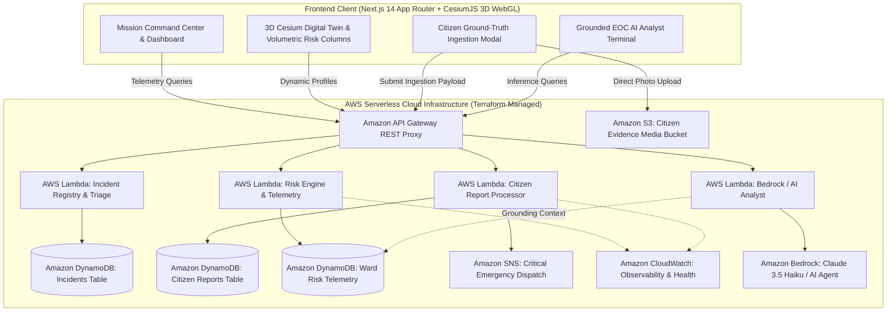

# 🌊 FloodSense
### *AI-Powered Hyperlocal 3D Flood Intelligence & Emergency Response Platform*

[](https://www.wemakedevs.org/aws/env)
[](#-aws-serverless-cloud-architecture)
[](#%EF%B8%8F-technology-stack)
[](#-pillar-4-grounded-ai-flood-analyst--incident-terminal)
[](LICENSE)

> **Predict. Verify. Respond.**  
> Moving from passive flood alerts to active, hyperlocal 3D digital twins and coordinated emergency response.

---

## 📌 Executive Summary

Current municipal flood monitoring systems routinely announce generic warnings: *"It is raining heavily in Mumbai."*  
For citizens, municipal engineers, and disaster response teams, that provides zero actionable insight. The real operational questions are:
- **Which specific administrative wards and arterial corridors will submerge first?**
- **At what hour will localized precipitation and runoff overwhelm drainage networks?**
- **Why is a specific zone failing (low elevation, high topographic wetness, coastal tidal lock, or drainage blockage)?**
- **What verified evacuation routes and pump deployments should be mobilized right now?**

**FloodSense** is an enterprise-grade, full-stack 3D flood intelligence and tactical response platform built on **AWS Serverless infrastructure** and **CesiumJS 3D WebGL**. It ingests real-time telemetry, 20 years of historical monsoon memory (1990–2024), high-resolution topography, and live citizen ground-truth reports to produce explainable risk indices, volumetric 3D inundation models, automated early warnings, and grounded AI incident response protocols.

---

## 🎯 Hackathon Metadata

| Field | Detail |
| :--- | :--- |
| **Event** | AWS Environmental Hacks (WeMakeDevs) |
| **Track** | **Heat & Water** (Urban Flooding & Monsoon Hydrology) |
| **Target Pilot City** | **Mumbai Metropolitan Region** (24 BMC Administrative Wards) |
| **Cloud Provider** | **Amazon Web Services (AWS)** — 100% Serverless & IaC via Terraform |
| **Core Differentiator** | **Predict + Verify + Respond** (Volumetric 3D digital twin + explainable physics engine + S3/DynamoDB citizen verification + grounded Bedrock AI analyst) |

---

## 🏛️ System Architecture



---

## 🚀 Core Platform Pillars

### 🌐 Pillar 1: Volumetric 3D Geospatial Digital Twin (CesiumJS)
- **Real-World Elevation & Terrain:** Accurately models Mumbai's coastal and lowland topography via high-resolution ellipsoid terrain streaming.
- **Volumetric 3D Risk Extrusion:** Replaces flat 2D map washes with physical **3D extruded risk columns (up to 480m)**. Wards under critical flood inundation rise into prominent, luminescent titanium-frosted 3D glass pillars whose heights scale dynamically with 3-day precipitation accumulation.
- **Tactical 3D HUD Micro-Pills:** Floating telemetry cards anchored directly to the 3D rooftop of each column, showing rainfall, hazard type, and time-to-surge countdown without visual clutter.
- **Isometric & Top-Down Camera Toggle:** Instant switching between an isometric 38° tilt perspective and a top-down operational view.
- **High-Performance Architecture:** Concurrency-throttled Web Workers, base-layer pre-fetching, and offline PWA cache suppression deliver sub-4s instant page loads.

### 🧮 Pillar 2: Explainable Physics & Hydrologic Intelligence Engine
- **Multi-Factor Physics Modeling:** Evaluates 3-day cumulative rainfall, Topographic Wetness Index (TWI), elevation, soil moisture saturation, and land surface temperature (LST).
- **Transparent Risk Attribution:** Every ward risk score (0–100 and Severity Levels 0–3) provides a transparent percentage breakdown (e.g., *Rainfall Overflow 38% + Low Elevation Pooling 32% + Tidal Lock 18%*), eliminating opaque black-box AI decisions.
- **20-Year Climate Memory:** Benchmarks real-time conditions against historical Mumbai catastrophes (July 26, 2005 Deluge, August 29, 2017 Storm, July 2, 2019 Overflow, July 18, 2021 Surge).

### 📱 Pillar 3: Citizen Ground-Truth Verification Pipeline
- **Crowdsourced Sensor Network:** Mobile-responsive interface allowing citizens to submit real-time water levels (*Road Wet, Ankle Deep, Knee Deep, Waist Deep, Severe Submersion*).
- **AWS S3 Photo Ingestion:** Direct multipart photo evidence upload to Amazon S3 media buckets.
- **Prediction vs. Reality Validation Loop:** Automatically correlates mathematical flood models against geolocated citizen field reports to verify incidents and adjust confidence scores in real time.

### 🤖 Pillar 4: Grounded AI Flood Analyst & Incident Terminal
- **EOC Tactical Protocols:** Integrated terminal powered by Amazon Bedrock (Claude 3.5 Haiku) and Groq LLaMA-3.3 that synthesizes telemetry into municipal incident action plans.
- **Strict Grounding Guardrails:** System prompts force the AI to reason solely over verified DynamoDB ward statistics and climate data, preventing catastrophic hallucinations during crisis management.
- **Automated SNS Emergency Dispatch:** Fires automated incident alerts across multi-channel SMS and email topics when critical thresholds are breached.

---

## 🎨 Design System: Frosted Obsidian & Titanium

FloodSense features a purpose-built, high-contrast dark theme inspired by industrial command centers and tactical defense interfaces (Linear / Palantir aesthetic):

- **Background:** Deep Pitch Black / Obsidian (`#0B0D12` and `#000000`).
- **Typography:** `Clash Grotesk` (display headings), `Satoshi` (tactical body copy), and `JetBrains Mono` (telemetry, coordinates, and codes).
- **Severity Hierarchy:**
  - **Level 3 (Critical):** Pure Titanium White (`#FFFFFF`) with solid white pills, glowing outlines, and high-visibility badges.
  - **Level 2 (Elevated):** Light Zinc (`#D4D4D8` / `zinc-300`).
  - **Level 1 (Watch):** Slate Grey (`#71717A` / `zinc-500`).
  - **Level 0 (Nominal):** Graphite (`#27272A` / `zinc-800`).

---

## 🖥️ Platform Walkthrough

| Route | Interface | Key Capabilities |
| :--- | :--- | :--- |
| **`/`** | **Landing Page** | Project mission, interactive wave canvas, live telemetry preview, and quick launch pad. |
| **`/map`** | **3D Geospatial Twin** | Interactive CesiumJS 3D globe, volumetric extruded risk prisms, simulation scrubber, 3D tilt toggle, and floating HUD micro-pills. |
| **`/dashboard`** | **Mission Telemetry** | Monitored ward metrics, high-contrast severity charts, sorting vulnerability tables, and real-time AWS synchronization indicators. |
| **`/alerts`** | **Alert Command Center** | Threat spectrum ribbon, proportional severity distribution bar, filtered ward status dossiers, and chronological event timelines. |
| **`/reports`** | **Analytical Reports** | Deep-dive ward risk profiles, historical disaster match cards, drainage capacity assessments, and evacuation routes. |

---

## ☁️ AWS Serverless Cloud Architecture

The cloud backend is deployed with **Terraform** in `ap-south-1` (Mumbai):

```
terraform/
├── apigateway.tf       # API Gateway REST API with CORS & Lambda proxy integrations
├── lambda.tf           # AWS Lambda functions (Python 3.12 runtime)
├── dynamodb.tf         # DynamoDB tables (incidents, citizen_reports, risk_cache)
├── s3.tf               # S3 media bucket with public-read policy for report photos
├── sns.tf              # Emergency alert SNS topic for broadcast dispatches
├── iam.tf              # Least-privilege IAM execution roles and policies
├── main.tf             # AWS provider configuration
└── outputs.tf          # API Gateway endpoints and resource ARNs
```

### Deployed Endpoints
- `GET  /api/risk-score` — Ward-by-ward hydrologic risk assessment.
- `GET  /api/incidents` — Active verified flood incidents and status.
- `POST /api/citizen-reports` — Citizen ground-truth reports with S3 media URLs.
- `POST /api/ai-analyst` — Grounded natural-language EOC briefing generation.

---

## 🛠️ Technology Stack

| Layer | Technologies |
| :--- | :--- |
| **Frontend Framework** | Next.js 14 (App Router), React 19, TypeScript |
| **3D Geospatial Engine** | CesiumJS, WebGL, 3D OSM Building Meshes, Esri World Imagery |
| **Styling & Animation** | Tailwind CSS, Framer Motion, Lucide Icons |
| **State Management** | Zustand (persistent simulation timeline & active city state) |
| **Cloud Infrastructure** | AWS Lambda, Amazon API Gateway, Amazon DynamoDB, Amazon S3, Amazon SNS |
| **Infrastructure as Code** | HashiCorp Terraform |
| **AI / LLM Integration** | Amazon Bedrock (Claude 3.5 Haiku), Groq SDK (LLaMA-3.3 70B Versatile) |

---

## 🚀 Quickstart & Local Setup

### 1. Prerequisites
- **Node.js** (v18.17+ or v20+)
- **npm** or **bun**
- **Terraform** (v1.5+ optional, for cloud deployment)
- **Cesium Ion Token** (free account at [ion.cesium.com](https://ion.cesium.com))

### 2. Frontend Installation

```bash
# Clone the repository
git clone https://github.com/ChirayuMarathe/FloodSense.git
cd FloodSense/frontend_repo

# Install dependencies
npm install

# Configure environment variables
cp .env.example .env.local
```

Add your Cesium Ion token in `.env.local`:
```env
NEXT_PUBLIC_CESIUM_TOKEN="your_cesium_token_here"
NEXT_PUBLIC_FLOODSENSE_API_URL="https://jd8e1lou1k.execute-api.ap-south-1.amazonaws.com"
GROQ_API_KEY="your_groq_api_key_optional"
```

Start the local development server:
```bash
npm run dev
```
Open **`http://localhost:3000`** in your browser.

### 3. Deploying AWS Infrastructure (Optional)

```bash
cd terraform
terraform init
terraform apply -auto-approve
```

---

## 📂 Repository Layout

```
FloodSense/
├── frontend_repo/             # Next.js 14 + CesiumJS 3D Web Application
│   ├── src/
│   │   ├── app/               # Next.js App Router (map, dashboard, alerts, reports)
│   │   ├── components/        # 3D Cesium views, HUD tags, stat cards, modals
│   │   ├── lib/               # Risk engine, GIS geometry layers, AWS client
│   │   └── store/             # Zustand simulation timeline store
│   └── public/                # Cesium Web Workers, GIS GeoJSON datasets
├── backend/                   # AWS Lambda serverless microservices
│   ├── lambdas/
│   │   ├── risk_engine/       # Hydrologic telemetry & risk calculations
│   │   ├── citizen_reports/   # Citizen evidence ingestion
│   │   ├── incidents/         # Municipal incident registry
│   │   └── ai_analyst/        # Grounded Bedrock / LLM analyst
│   └── scripts/               # DynamoDB database seed scripts
├── terraform/                 # Infrastructure as Code (AWS Serverless)
├── docs/                      # Architectural specs & technical deep-dives
├── README.md                  # Master Project Readme
└── LICENSE                    # Open-source MIT License
```

---

## ⚖️ Hackathon Compliance Notice

*This repository represents original, clean-slate work created specifically for the October 8–11, 2026 WeMakeDevs AWS Environmental Hacks event. All commit histories, AWS resources, and code artifacts correspond directly to the official hackathon development window.*
