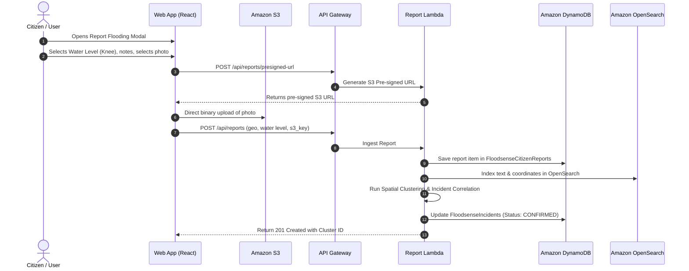

# 👥 Citizen Ground-Truth & Incident Verification Pipeline
### Closing the Loop Between Predictive Models & Physical Reality

---

## 1. Why Citizen Ground-Truth is the Core Differentiator

Traditional flood models operate as one-way broadcasts: satellite/radar data enters, a forecast is produced, and the agency hopes it was accurate.

**FloodSense introduces a closed-loop cyber-physical pipeline:**

$$\text{Predict} \longrightarrow \text{Verify} \longrightarrow \text{Respond} \longrightarrow \text{Learn}$$

1. **Predict:** Risk engine forecasts an 87% flood likelihood in Kalamboli.
2. **Verify:** Citizens on the ground report knee-deep water and upload photos.
3. **Respond:** The system upgrades the incident status to **Prediction Confirmed** and triggers municipal pump dispatch.
4. **Learn:** Prediction vs. reality feedback records true positives, tuning future risk calibration.

```
┌─────────────────────────────────┐
│ MODEL PREDICTION: 87% CRITICAL  │
└────────────────┬────────────────┘
                 │
                 ▼
┌─────────────────────────────────┐
│ GROUND REPORTS: 14 CITIZENS     │
└────────────────┬────────────────┘
                 │
                 ▼
┌─────────────────────────────────┐
│ STATUS: PREDICTION CONFIRMED    │
└─────────────────────────────────┘
```

---

## 2. Ingestion Flow & Component Architecture



---

## 3. Spatial Clustering & Incident Verification Logic

To prevent spam, deduplicate incidents, and eliminate false positives, the ingestion Lambda executes spatial-temporal clustering:

### Spatial-Temporal Proximity Rule:
Two reports $R_A$ and $R_B$ belong to the same incident cluster if:
1. **Geographic Proximity:** Haversine distance $D(R_A, R_B) \le 500\text{ meters}$.
2. **Temporal Proximity:** Timestamp delta $|T_A - T_B| \le 90\text{ minutes}$.
3. **Same Zone Boundary:** Both coordinates fall within the identical ward boundary polygon.

### Incident Verification State Machine:

```
[ New Report Received ]
          │
          ▼
   Has Photo or ≥ 2 Adjacent Reports?
     ├── NO ──> [ Status: PENDING_VERIFICATION ]
     │
     └── YES ─> [ Status: CLUSTER_DETECTED ]
                     │
                     ▼
             Is Zone Risk ≥ 65%?
               ├── YES ─> [ Status: PREDICTION_CONFIRMED 🟢 ]
               └── NO  ─> [ Status: UNEXPECTED_FLASH_FLOOD ⚠️ ]
```

- **`PENDING_VERIFICATION`:** Single isolated report without photo evidence. Displayed on the map as an unverified point.
- **`CLUSTER_DETECTED`:** 2 or more reports within 500m within 90 minutes.
- **`PREDICTION_CONFIRMED`:** Cluster corroborates a model risk score $\ge 65\%$. Proves model accuracy and elevates priority to critical response.
- **`UNEXPECTED_FLASH_FLOOD`:** High-severity ground reports occur in an area previously rated low risk (e.g. localized drain blockage). The system immediately flags this anomaly to municipal dispatchers and boosts the zone's citizen weight factor $F_{\text{citizen}}$.

---

## 4. Mobile-First Citizen Reporting Interface

The reporting modal is engineered for rapid, friction-free submission during stormy conditions:

### Input Fields:
1. **One-Tap Geolocation:** Uses HTML5 `navigator.geolocation` with fallback zone selector.
2. **Visual Water Level Chips:**
   - 💧 **Road Wet** *(Puddles, standard driving possible)*
   - 👟 **Ankle Deep** *(Curbs submerged, pedestrian difficulty)*
   - 👖 **Knee Deep** *(Sedans risk stalling, underpasses blocked)*
   - 🩱 **Waist Deep** *(Emergency rescue required, transit halted)*
   - 🚨 **Severe / Over Waist** *(Flash deluge, structural danger)*
3. **Photo Evidence:** File input supporting direct camera capture.
4. **Context Description:** Text field for landmarks (e.g. *"Near Kalamboli circle bus stop"*).

---

## 5. Model Evaluation: Prediction vs. Reality Tracking

To demonstrate genuine machine learning rigor during the hackathon evaluation:
- Every calculated prediction is archived with its timestamp.
- When incidents are verified by ground reports, the system logs the outcome in DynamoDB:
  - **True Positive (TP):** High Risk ($\ge 65\%$) predicted and confirmed by $\ge 3$ ground reports.
  - **False Positive (FP):** High Risk predicted, but zero ground reports and clear conditions observed.
  - **False Negative (FN):** Low Risk predicted, but sudden ground flooding reported.
  - **True Negative (TN):** Low Risk predicted, zero incidents occurred.

These figures feed the **Model Performance Dashboard Card**, rendering live precision, recall, and accuracy metrics derived from actual event logs rather than hardcoded mockups.
